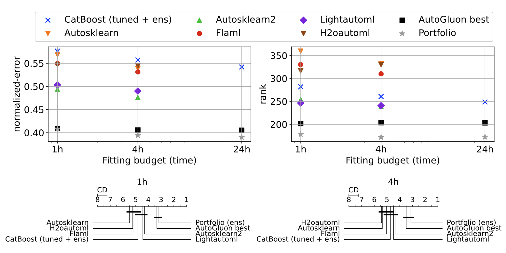

# TabRepo

TabRepo contains the predictions and metrics of 1206 models evaluated on 200 classification and regression datasets. 
This allows to compare for free against state-of-the-art AutoML systems or random configurations by just querying 
precomputed results. We also store and expose model predictions so any ensembling strategy can also be benchmarked 
cheaply by just querying precomputed results.

We give scripts from the paper so that one can reproduce all experiments that compare different models and portfolio
strategies against state-of-the-art AutoML systems.

The key features of the repo are:
* 1206 models evaluated on 200 datasets with 3 distinct folds
* 273 GB of model predictions
* code to compare methods against state-of-the-art AutoML systems and random model configurations
* fast evaluations of any ensemble of models from table lookups with a few engineering tricks:
  * fast metric evaluations with specific optimized cpp code (for instance to compute roc auc)
  * efficient format that loads model evaluation on the fly with low memory footprint



 
## Installation

To install the repository, run

```bash
# TODO update repo address and name
git clone https://github.com/autogluon/tabrepo.git
cd tabrepo  
pip install -e .
```

In addition, if you are interested in reproducing the experiments of the paper, you will need those extra dependencies:

```bash
# Install AG benchmark, required only to reproduce results showing win-rate tables
git clone https://github.com/autogluon/autogluon-benchmark.git
pushd autogluon-benchmark
pip install -e .
popd

# Install extra dependencies used for experimental scripts
pip install "autorank"
pip install "seaborn"
```

You are all set!

## Quick-start

**Recommended: Refer to `examples/run_quickstart.py` for a full runnable tutorial.**

Now lets see how to do basic things with TabRepo.

**Accessing model evaluations.** To access model evaluations, you can do the following:

```python
from tabrepo import load_repository

repo = load_repository("D244_F3_C1416_30")
repo.metrics(datasets=["Australian"], configs=["CatBoost_r22_BAG_L1", "RandomForest_r12_BAG_L1"])
```

The code will return the metrics available for the configuration and dataset chosen. 

The example loads a smaller version of TabRepo with only a few datasets for illustrative purpose and shows
the evaluations of one ensemble and how to query the stored predictions of a given model.
When calling `load_repository` models predictions and TabRepo metadata will be fetched from the internet. We use a smaller version 
here as it can take a long time to download all predictions, in case you want to query all datasets, replace the context
with `D244_F3_C1416_30`.


**Querying model predictions.**
To query model predictions, run the following code:
```python
from tabrepo import load_repository
repo = load_repository("D244_F3_C1416_30")
print(repo.predict_val_multi(dataset="Australian", fold=0, configs=["CatBoost_r22_BAG_L1", "RandomForest_r12_BAG_L1"]))
```

This will return predictions on the validation set. 
You can also use `predict_test` to get the predictions on the test set.

**Simulating ensembles.**
To evaluate an ensemble of any list of configuration, you can run the following:
```python
from tabrepo import load_repository
repo = load_repository("D244_F3_C1416_30")
print(repo.evaluate_ensemble(datasets=["Australian"], configs=["CatBoost_r22_BAG_L1", "RandomForest_r12_BAG_L1"]))
```

this code will return the error of an ensemble whose weights are computed with the Caruana procedure after loading model
predictions and validation groundtruth.

## Available Contexts

Context's are used to load a repository and are downloaded from S3 with the following code:

```python
from tabrepo import load_repository
repo = load_repository(context_name)
```

Below is a list of the available contexts in TabRepo.

| Context Name      | # Datasets | # Folds | # Configs | Disk Size | Notes                     |
| ----------------- | ---------- | ------- | --------- | --------- | ------------------------- |
| D244_F3_C1416     | 211        | 3       | 1416      | 273 GB    | All successful datasets. 64 GB+ memory recommended. May take a few hours to download. |
| D244_F3_C1416_200 | 200        | 3       | 1416      | 107 GB    | Used for results in paper. 32 GB memory recommended |
| D244_F3_C1416_175 | 175        | 3       | 1416      | 50 GB     | 16 GB memory recommended |
| D244_F3_C1416_100 | 100        | 3       | 1416      | 8.7 GB    | Ideal for fast prototyping |
| D244_F3_C1416_30  | 30         | 3       | 1416      | 1.0 GB    | Toy context |
| D244_F3_C1416_10  | 10         | 3       | 1416      | 0.2 GB    | Toy context |
| D244_F3_C1416_3   | 3          | 3       | 1416      | 30 MB     | Toy context |


## Reproducing paper experiments

To reproduce the experiments from the paper, run:

```bash
python scripts/baseline_comparison/evaluate_baselines.py --expname v1
```

The experiment will require ~200GB of disk storage and 32GB of memory (although we use memmap to load model predictions
on the fly, large dataset still have a significant memory footprint even for a couple of models). In particular, we
used a `m6i.4xlarge` machine for our experiments which took 1h 42m (less than $2 of compute).

All the table and figures of the paper will be generated under `scripts/figures` and `scripts/tables`.

## Future work

We have been using TabRepo to study potential data leakage in AutoGluon stacking, we believe the following are also 
potential interesting future work directions:

* finding good dataset features to enable strategies that condition on the dataset at hand
* adding transformer model evaluations in the dataset (FT-transformer, TabPFN, ...)
* adding evaluations from other domains such as time-series, CV or NLP
* improve the portfolio selection which currently use a greedy approach unaware of the ensembling effect

## Citation

If you find this work useful for you research, please cite the following:
```
@inproceedings{
   anonymous2023tabrepo,
   title={TabRepo: A Large Scale Repository of Tabular Model Evaluations and its Auto{ML} Applications},
   author={Anonymous},
   booktitle={Submitted to The Twelfth International Conference on Learning Representations},
   year={2023},
   url={https://openreview.net/forum?id=fTEPeQ00VM},
   note={under review}
}
```

We will update this reference with an Arxiv link soon.
